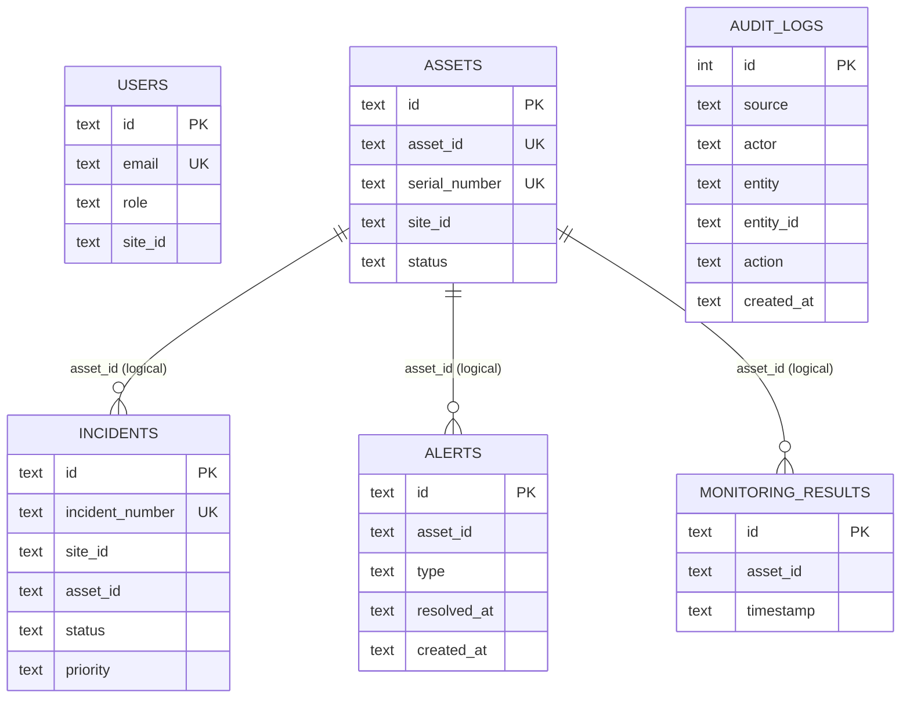

# DLOG Database Model

This document describes the current SQLite data model used by DLOG, including schema, indexes, and migration strategy.

## 1. Database Engine

- Engine: SQLite (better-sqlite3)
- File: backend/data/dlog.sqlite
- Journaling: WAL mode
- Foreign keys: Enabled (pragma), but current schema does not define explicit FOREIGN KEY constraints.

## 2. Migration Strategy

- Migration folder: backend/migrations
- Applied migrations table: schema_migrations
- Migration runner: backend/src/migrate.js
- Run command: npm run migrate --workspace=backend

Migration table definition:

```sql
CREATE TABLE IF NOT EXISTS schema_migrations (
  version TEXT PRIMARY KEY,
  name TEXT NOT NULL,
  applied_at TEXT NOT NULL
);
```

## 3. Current Schema (v0001)

Migration file: backend/migrations/0001_initial_schema.sql

### users

```sql
CREATE TABLE IF NOT EXISTS users (
  id TEXT PRIMARY KEY,
  email TEXT NOT NULL UNIQUE,
  password TEXT NOT NULL,
  role TEXT NOT NULL,
  site_id TEXT,
  json_data TEXT NOT NULL
);
```

### assets

```sql
CREATE TABLE IF NOT EXISTS assets (
  id TEXT PRIMARY KEY,
  asset_id TEXT NOT NULL UNIQUE,
  serial_number TEXT NOT NULL UNIQUE,
  site_id TEXT NOT NULL,
  status TEXT,
  json_data TEXT NOT NULL
);
```

### incidents

```sql
CREATE TABLE IF NOT EXISTS incidents (
  id TEXT PRIMARY KEY,
  incident_number TEXT NOT NULL UNIQUE,
  site_id TEXT NOT NULL,
  asset_id TEXT NOT NULL,
  status TEXT NOT NULL,
  priority TEXT NOT NULL,
  json_data TEXT NOT NULL
);
```

### alerts

```sql
CREATE TABLE IF NOT EXISTS alerts (
  id TEXT PRIMARY KEY,
  asset_id TEXT NOT NULL,
  type TEXT NOT NULL,
  resolved_at TEXT,
  created_at TEXT,
  json_data TEXT NOT NULL
);
```

### monitoring_results

```sql
CREATE TABLE IF NOT EXISTS monitoring_results (
  id TEXT PRIMARY KEY,
  asset_id TEXT NOT NULL,
  timestamp TEXT NOT NULL,
  ip_address TEXT,
  cpu_usage REAL,
  memory_usage REAL,
  disk_free_percent REAL,
  backup_status TEXT,
  raw_json TEXT NOT NULL
);
```

### audit_logs

```sql
CREATE TABLE IF NOT EXISTS audit_logs (
  id INTEGER PRIMARY KEY AUTOINCREMENT,
  source TEXT NOT NULL,
  actor TEXT NOT NULL,
  entity TEXT NOT NULL,
  entity_id TEXT,
  action TEXT NOT NULL,
  previous_value TEXT,
  new_value TEXT,
  created_at TEXT NOT NULL
);
```

## 4. Indexes

```sql
CREATE INDEX IF NOT EXISTS idx_assets_site_id ON assets(site_id);
CREATE INDEX IF NOT EXISTS idx_incidents_site_id ON incidents(site_id);
CREATE INDEX IF NOT EXISTS idx_incidents_status ON incidents(status);
CREATE INDEX IF NOT EXISTS idx_alerts_asset_id ON alerts(asset_id);
CREATE INDEX IF NOT EXISTS idx_alerts_type_resolved ON alerts(type, resolved_at);
CREATE INDEX IF NOT EXISTS idx_monitoring_asset_ts ON monitoring_results(asset_id, timestamp);
CREATE INDEX IF NOT EXISTS idx_audit_entity_ts ON audit_logs(entity, created_at);
```

## 5. Logical Relationships



## 6. Notes on the Model

- Domain payloads are stored as JSON snapshots in json_data/raw_json columns.
- Scalar columns are used for lookup, filtering, uniqueness, and indexing.
- This is a hybrid relational + document pattern optimized for simplicity and backward compatibility.
- Future normalization can be introduced via new incremental migration files (for example, 0002_add_foreign_keys.sql, 0003_split_asset_details.sql).
